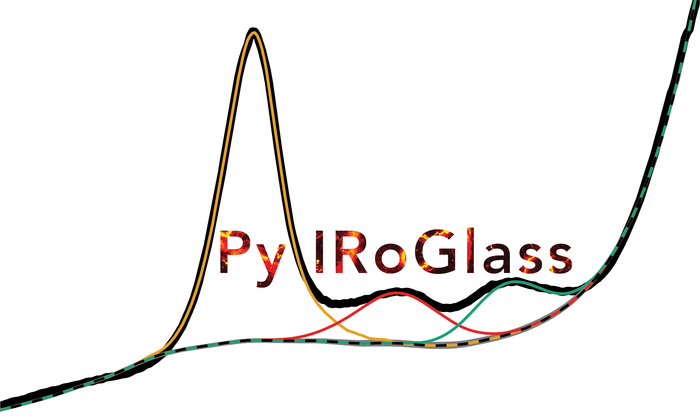

.. PyIRoGlass documentation master file, created by sphinx-quickstart on July 21
   You can adapt this file completely to your liking, but it should at least
   contain the root `toctree` directive.

Welcome to PyIRoGlass's documentation!
======================================

.. toctree::
   :maxdepth: 2
   :caption: Contents

   introduction
   installation
   importing_data
   submitting_data
   FAQs
   Changelog

.. toctree::
   :maxdepth: 2
   :caption: Transmission FTIR

   examples/transmission_ftir/PyIRoGlass_Transmission

.. toctree::
   :maxdepth: 2
   :caption: Reflectance FTIR

   examples/reflectance_ftir/PyIRoGlass_Reflectance

.. toctree::
   :maxdepth: 2
   :caption: Density/Molar Absorptivity Calculators

   examples/ftir_functions/PyIRoGlass_Functions

.. toctree::
   :maxdepth: 2
   :caption: Molar Absorptivity Inversion

   examples/inversion/PyIRoGlass_Inversion

.. toctree::
   :maxdepth: 2
   :caption: Detailed Code Documentation

   codedoc

.. toctree::
   :maxdepth: 2
   :caption: References

   references

